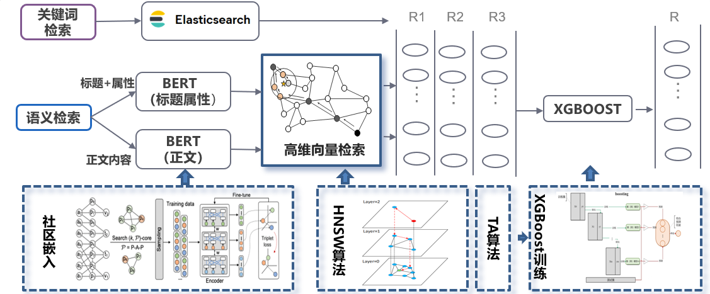

<!-- PROJECT LOGO -->

<br />

<div align="center">
  <!-- <a href="https://github.com/othneildrew/Best-README-Template">
    
  </a> -->

  <h3 align="center">Policy-Retrieval-BERT </h3>

  <p align="center">
   A Poicy Retrieval and Recommend System Developed with PLM-BERT and Graph Inference
    <br />
    <a href="https://github.com/Polarisjame/Policy_Retrieval_BERT.git"><strong>Explore the docs »</strong></a>
    <br />
  </p>

</div>

<a id="readme-top"></a>

> 项目刚部署于服务器上。我们租的服务器不怎么好，很容易崩。:crying_cat_face:，所以等主办方检测完再把链接发上来吧。

<!-- TABLE OF CONTENTS -->

<details>
  <summary>Table of Contents</summary>
  <ol>
    <li><a href="#about-the-project">About The Project</a>
      <ul>
        <li><a href="#Retrieval">Retrieval System</a></li>
        <ul>
          <li><a href="#Encoding">Encoding Module</a></li>
          <li><a href="#Triplet">Triplet Loss Training module</a></li>
          <li><a href="#Fusion">Fusion Layer</a></li>
        </ul>
        <li><a href="#Recommend">Recommend System</a></li>
      </ul>
    </li>
    <li>
      <a href="#getting-started">Getting Started</a>
      <ul>
        <li><a href="#requirements">Requirements</a></li>
        <li><a href="#Preprocess">Preprocess</a></li>
        <li><a href="#tripletstrain">Triplets Training</a></li>
        <li><a href="#fusioncode">Fusion Layer</a></li>
        <li><a href="#recommendcode">Recommend</a></li>
      </ul>
    </li>
    <li>
      <a href="#License">License</a>
    </li>
  </ol>
</details>


<!-- ABOUT THE PROJECT -->

## About The Project

This system consists of two parts

### <div id="Retrieval">Retrieval System</div>

As shown in Figure,The Retirval System is divided into two Channels: KeyWords Retieval and Semantic Retrieval.We use ElasticSearch [ES]([www.elastic.co](https://www.elastic.co/elasticsearch/)) for KeyWords Search. Our Semantic Retrieval Channel mainly consists of 4 modules: Encoding module, Community Embedding module, High-dimensional vector retrieval module, Triplet Loss Training mudule. Then we use Xgboost to fusion the results from different Channels.



#### <div id="Encoding">Encoding Module</div>

The input data consists of the Title, Body, and other attributes of the policy. We use **PLM model**(e.g.,BERT/RoBERTa) to extract Semantic informations in policy's title and body.And we use **onehot embedding** to embed other attributes of a ploicy.

**Community Embedding module** and **High-dimensional vector retrieval module** is Implemented by my teammates

#### <div id="Triplet">Triplet Loss Training module</div>

From **Community Embedding Module**, We can split all policies into diffrent communities.To help PLM better distinguish policies from different communities,We build triplets from Community Graph and fine-tune the PLM using **tripletloss**
$$L = Max(d(a,p)-d(a,n)+margin,0)$$
where $d$ refers to Euclidean distance,$a,p$ and $n $ represent anchor, positive and negative points respectively.margin is a super parameter.Here we randomly select 10% of all policies from different communities as anchor points, and define points in the same community as anchor points as positive points.Further, We select the **semi-hard triplets**(i.e.,$0<L<margin$,which means the positive point is closer to the anchor but not close enough) as traindataset.

Besides, considering the difference between Policy Title and Policy BERT, we treat title as a special kinds of keywords, Therefore, **We split our Retrieval System into another two Channels** : Title2Body and Body2Body.In Title2Body channel, we select the concatenate of policy title and other attributes as anchor points, Body as positive and negative points.In Body2Body channel, we select  policy body as anchor, positive and negative points. 

Then,two Retrieval Channels provide two models, We send the origin policy data into two models parallelly, and the output of each model is sent into **High-dimensional vector retrieval module** and get the output of semantic retrival.

#### <div id="Fusion">Fusion Layer</div>

In sum up, we obtain a 3 channel result : ES , Title2Body, Body2Body. The intersection of these results is most appropriate, but it's also time-consuming.Thus, We use Xgboost model to help the model learn the rank of intersection.In detail, we calculate the average similarity in intersection, and let other policy's similarity that not included in ther intersection as 0.Then, we apply xgboost to fit the Mean Similarity.

### <div id="Recommend">Recommend System</div>

The traditional method in recommend fields is using collaborative filtering model, which ignore the origin feature of User and Item.Inspired by [GCMC](https://www.kdd.org/kdd2018/files/deep-learning-day/DLDay18_paper_32.pdf) and [LSR](https://aclanthology.org/2020.acl-main.141/) ,we treat the recommend task as link prediction,using graph convolutional model to gather the featuer between user and items and further treat the structure of the graph as a learnable latent parameter.


<p align="right">(<a href="#readme-top">back to top</a>)</p>

<!-- GETTING STARTED -->

## Getting Started

### Requirements

My code works with the following environment.

* `python=3.7`
* `pytorch=1.6.0+cu102`
* `dgl-cu102(0.4.3)`
* ubuntu20.04

### Dataset

+ Download data from [dataLink](https://drive.google.com/file/d/1PNIwGc5kB3kBsf4SmhNw0UZiHSJMHL50/view?usp=sharing) 

### <div id="Preprocess">Preprocess</div>

1. put the downloaded data under ./init_data_process/data

   ```
   cd ./init_data_process
   python preprocess2DBLP.py
   ```

2. the result used to build community is stored under ./init_data_process/results

3. Produce Random Anchor

   ```
   python Random_sample.py
   ```

4. Random sample result is stored under ./init_data_process/results/random_sample

5. Produce triplets

   ```
   python read_sample.py
   ```

### <div id="triplettrain">Triplets Training</div>

1. put `triplets_body.csv/data_sample.csv/category_index.txt` produced in Preprocess under ./train_model/data
2. put origin policy data `policyinfo_new.tsv` under ./train_model/Conver2vec/data

```
cd ../
sh run_BERT_MLP.sh gpu_id # train model
sh test_BERT_MLP.sh gpu_id # evaluate
```

Index_type: 'Title' means Title2Body Channel, 'Body' means Body2Body Channel.

+ Convert Origin policy data into vector:

  ```
  cd ./Conver2vec
  sh convert_data.sh gpu_id
  ```

### <div id="fusioncode">Fusion Layer</div>

1. put results of 3 channels under ./Fusion/data

``` 
cd ../../Fusion
python TA.py
```

### <div id="recommendcode">Recommend</div>

``` 
cd ../UserCF
python UserCF.py
```

<p align="right">(<a href="#readme-top">back to top</a>)</p>

## <div id="License">License</div>

This project is licensed under the MIT License - see the [LICENSE](https://github.com/Polarisjame/Policy_Retrieval_BERT/main/LICENSE) file for details.